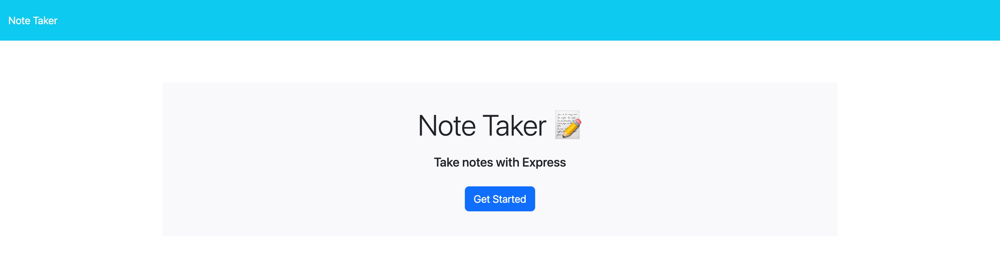
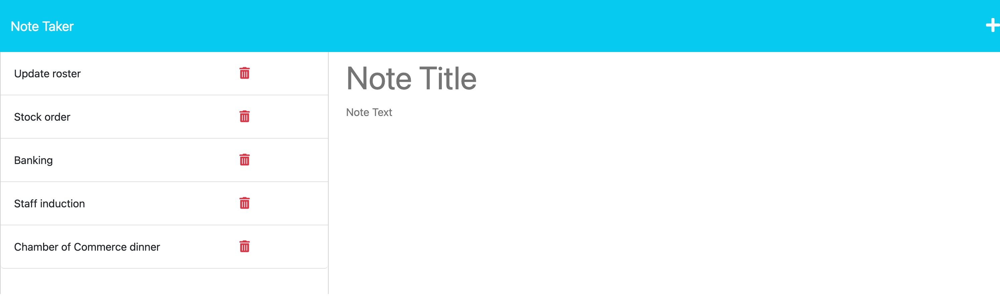
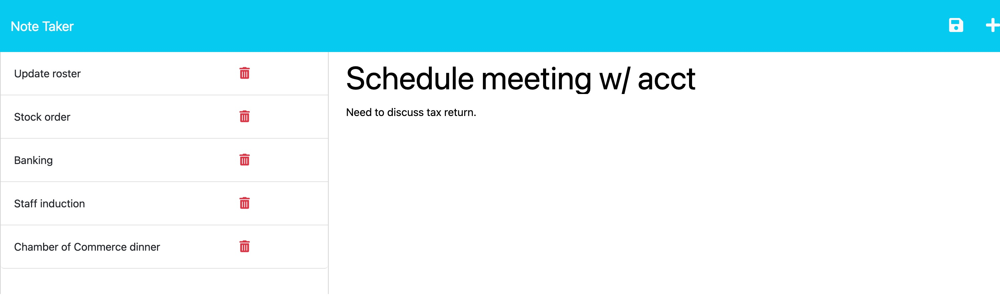
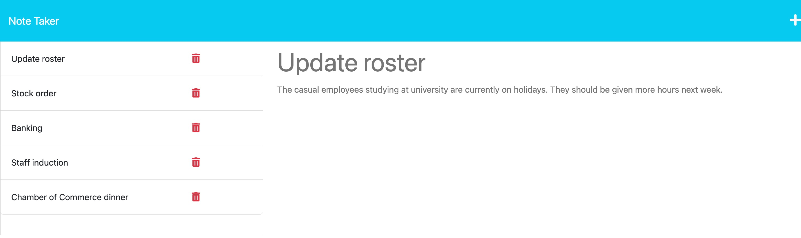

# Note Taker

[](https://opensource.org/licenses/ISC)

## Description
Owning a business is difficult work. Managing staff, processes, and staying up to date with the many and varied tasks can be overwhelming without a way of staying organised.

Note Taker was created with a view to helping business owners in this endeavour. This application will supply you with the means to jot down your thoughts; organised and succinct or loose and free form, that's up to you. Note Taker doesn't judge.

[Deployed page](https://note-taker-mqas1.herokuapp.com/) on Heroku.
  
## Table of Contents
  
- [Description](#description)
- [Installation](#installation)
- [Usage](#usage)
- [Credits](#credits)
- [License](#license)
- [Contributing](#contributing)
  
## Installation
  
Run the following command, ```npm i```, to install the required packages.
  
## Usage
The user is presented with a landing page and clicks the "Get Started" button, which redirects the user to the notes page.

The user writes a note title and note text. A save button appears in the top right when this is done. The user can save this note whereby it is saved to a JSON file acting as a database through a HTTP ```POST``` request. 

The saved note is displayed on the left hand side of the page through a HTTP ```GET``` request. When the user clicks on the saved note the note title and text is displayed on the right hand side.

Each saved note has a delete button whereby the user triggers a ```DELETE``` request with the click event. Thus deleting the saved note from the JSON file/database.

To add another note the user clicks on the addition button in the top right of the header.

---

### Screenshots





---

## Credits
Front-end developped by [edX](https://techbootcamp.sydney.edu.au/coding/) and back-end developed and integrated by [Morgan Qasabian](https://github.com/mqas1). 
  
## License
This application is covered under the [ISC License](https://opensource.org/licenses/ISC):
        
        Copyright 2023 edX/mqas1

        Permission to use, copy, modify, and/or distribute this software for any purpose with or without fee is hereby granted, provided that the above copyright notice and this permission notice appear in all copies.

        THE SOFTWARE IS PROVIDED "AS IS" AND THE AUTHOR DISCLAIMS ALL WARRANTIES WITH REGARD TO THIS SOFTWARE INCLUDING ALL IMPLIED WARRANTIES OF MERCHANTABILITY AND FITNESS. IN NO EVENT SHALL THE AUTHOR BE LIABLE FOR ANY SPECIAL, DIRECT, INDIRECT, OR CONSEQUENTIAL DAMAGES OR ANY DAMAGES WHATSOEVER RESULTING FROM LOSS OF USE, DATA OR PROFITS, WHETHER IN AN ACTION OF CONTRACT, NEGLIGENCE OR OTHER TORTIOUS ACTION, ARISING OUT OF OR IN CONNECTION WITH THE USE OR PERFORMANCE OF THIS SOFTWARE.
         
## Contributing
  
The guidelines for contributing to this application can be found at the [Contributor Covenant](https://www.contributor-covenant.org/).
     
---
  
*This README was made with ❤️ by the [README Generator](https://github.com/mqas1/readme-generator)*